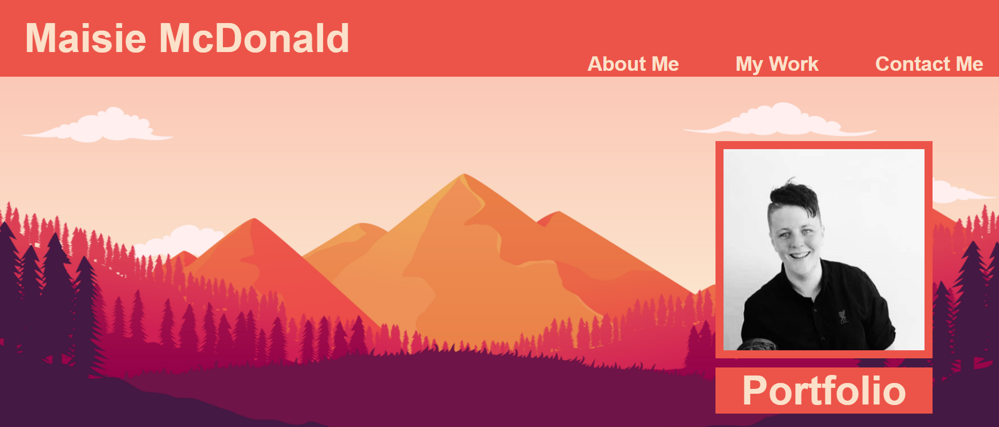
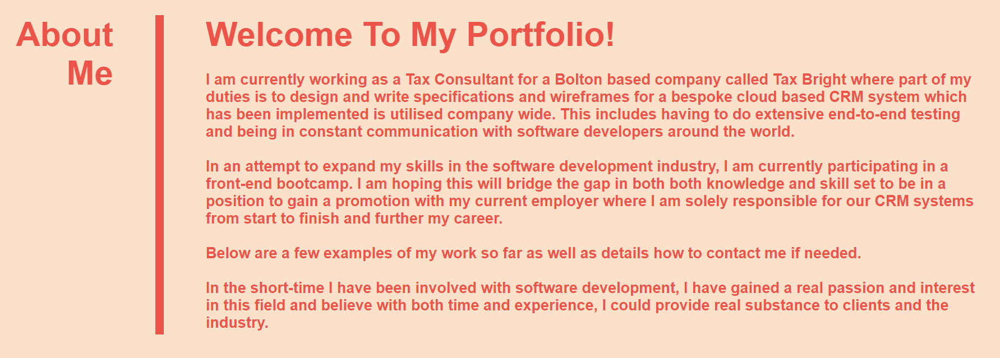
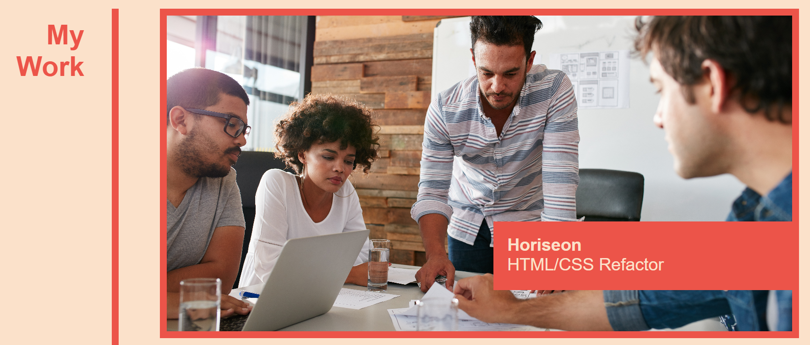
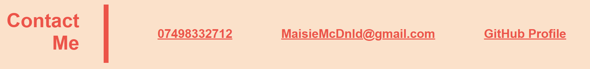
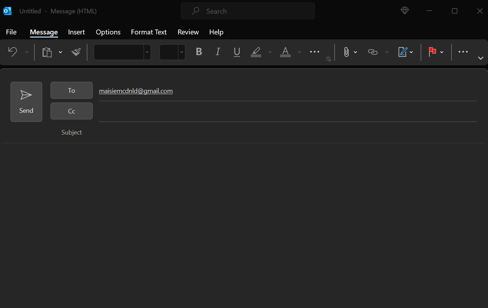

# My Portfolio

## Description
The motivation behind this project was to create a Portfolio page that will showcase my work as I progress through this bootcamp and as I enter my future career in front-end development. In addition to this, the aim was to utlise additional skills such as CSS Flexbox, CSS Grid and Media Queries to create a web page that was responsive to different screen sizes as well as creating higher quality designs. Throughout this project I have learnt the following:
- How to implement css media queries to create responsive web pages.
- How CSS Flexbox and Grid can be used to create multiple layouts and designs.

#

## Table Of Contents
- [Usage](#usage)
- [Credits](#credits)
- [Deployment](#deployment)
- [License](#license)

#

## Usage
The portfolio web page has three main navigational links:
- About Me
- My Work
- Contact Me

This can be seen in the screenshot below:

When each navigational link is clicked, the user is taken to the corresponding section of the webpage as shown below:

CSS Grid has been used to create a tiled effect for examples of work. The main placeholder (Horiseon) also operates as a link to a deployed web page whilst the rest are placeholders for the time being.

Within the "Contact Me" section of the webpage, there are two functional links:
- Email Address
- GitHub Profile

When the email address link is clicked, an email window will open where an email can be sent as seen below:

When the GitHub Profile link is clicked, the user will be taken to my GitHub Profile.

Media queries have been used to make the page responsive when accessed on a different sized screen. I have done this to the following width boundaries:
- Minimum Width = 648 pixels
- Maximum Width = 1000 pixels

#

## Credits
Throughout working on this project/challenge, I sought the knowledge and advice from multiple sources including:
- https://www.w3schools.com/css/css3_flexbox.asp
- https://www.w3schools.com/css/css3_flexbox_container.asp
- https://www.w3schools.com/css/css3_flexbox_items.asp
- https://developer.mozilla.org/en-US/docs/Learn/CSS/CSS_layout/Flexbox
- https://developer.mozilla.org/en-US/docs/Web/CSS/CSS_Flexible_Box_Layout/Basic_Concepts_of_Flexbox
- https://www.w3schools.com/css/css3_mediaqueries.asp
- https://www.w3schools.com/cssref/css3_pr_mediaquery.php

#

## Deployment
Below is the link to the deployed web page using GitHub Pages:
- https://maccersm8.github.io/My-Porfolio/

#

## License
Copyright (c) 2022 Maisie McDonald

Permission is hereby granted, free of charge, to any person obtaining a copy
of this software and associated documentation files (the "Software"), to deal
in the Software without restriction, including without limitation the rights
to use, copy, modify, merge, publish, distribute, sublicense, and/or sell
copies of the Software, and to permit persons to whom the Software is
furnished to do so, subject to the following conditions:

The above copyright notice and this permission notice shall be included in all
copies or substantial portions of the Software.

THE SOFTWARE IS PROVIDED "AS IS", WITHOUT WARRANTY OF ANY KIND, EXPRESS OR
IMPLIED, INCLUDING BUT NOT LIMITED TO THE WARRANTIES OF MERCHANTABILITY,
FITNESS FOR A PARTICULAR PURPOSE AND NONINFRINGEMENT. IN NO EVENT SHALL THE
AUTHORS OR COPYRIGHT HOLDERS BE LIABLE FOR ANY CLAIM, DAMAGES OR OTHER
LIABILITY, WHETHER IN AN ACTION OF CONTRACT, TORT OR OTHERWISE, ARISING FROM,
OUT OF OR IN CONNECTION WITH THE SOFTWARE OR THE USE OR OTHER DEALINGS IN THE
SOFTWARE.